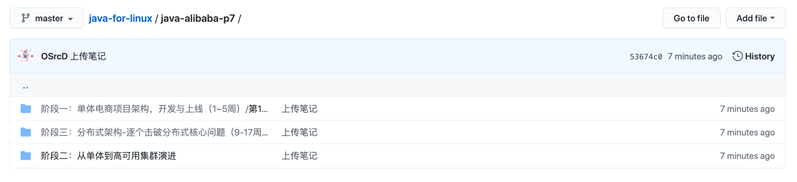

# Java-for-linux

## 欢迎大家一起来协作写（ Pull requests ）慕课网 Java 架构师直通车笔记

## 我的开源课程

<https://space.bilibili.com/77266754>

## 我的开源项目

<https://gitee.com/OpenDevel/java-for-linux>

## 在 JVM 源码内嵌写 Native 函数给 Java 层调用

JVM源码之写Java层代码

导出模块

JVM源码之写C++层代码

JVM源码之注册Java&C++层代码

JVM源码之写Makefile文件

JVM源码之编译生成的文件

JVM源码之写Java测试代码

## Java 游戏安全

## JNI 基于 Linux 动态函数注册

## Kali Linux 内核编程

## 开源工具箱项目

<https://github.com/OpenSrcDeveloper/OpenToolbox>

## 天天吃货大型电商通用平台核心主项目 

<http://120.77.47.215:8080/foodie-shop/>

## 天天吃货 WebRTC 一对多直播子项目

观众端:<https://120.77.47.215:8443/>

主播端:<https://120.77.47.215:8443/admin.html>

## 在线教育项目

## 社交分享项目

## 电影预告项目

## OA办公项目

## Java泡泡堂项目

## 2048小游戏项目

## 基于 Java For OpenCV 的百度云失效链接自动分享

## OSrcD的英语小抄

<https://www.wiz.cn/wapp/pages/applyJoinGroup?code=glfvvh>

add exagear-desktop-rpi3 project

## 开源项目福利

集成开源课程&项目免费申请 JetBrains 全家桶 IDEA 开源许可证认证者

可以免费使用JetBrains 全家桶所有产品

<https://www.jetbrains.com/shop/eform/opensource?product=ALL>

## 我的开源技术自学之路

### 计算机数学基础

### 计算机物理基础

### 计算机英语基础

### 软件&硬件基础

### 汇编基础
8086 汇编的经典是 16 位地址变为 20 位地址。

### C&C++ 基础
C 语言的经典是指针，我看了很多书都是说指针就是地址，这个没有错，但我觉得说对了一半，我觉得指针就是地址+类型，这个是我自学自己领悟出来的，书中也是有说的不全的，也有错误的。

### 算法基础

### Linux 基础

### Web 安全基础
Web 服务器基础

Google Hacking

Nmap

原理探测

实战经典

综和利用

......

网络信息收集

漏洞评估之 BurpSuite 使用实战

漏洞评估之 SqlMap 使用实战

漏洞评估之 Cookie 注入实战

漏洞评估之 Web 扫描实战

漏洞评估之 Nessus 使用实战

Backtrack 高级渗透教程

某工具讲解

无线安全的基本介绍

......

Android Java 逆向基础

Android Hook 插件开发

Android 系统编译

Android arm native 逆向

Android 应用初步编程保护

Android 应用脱壳

Android 应用保护

审计学院内部 Web 官网安全

......

审计学院内部的内网网络环境安全

......

审计学院内部的内网网络环境安全

......

审计学院内部的教学楼教师机器与学生机器内网安全

......

审计学院内部开发的人脸签到微信小程序

......

#### Web 安全与逆向工程方向的选择
不是什么都要学的，其实吧，精一门样样精，觉得Web安全入门没逆向工程更加有意思，如果能入门的Web安全，可以继续学，后面就会涉及到浏览器安全了，自然就涉及到逆向工程了，这个就是你精通Web安全的方向过程了，Web安全深入进去就是浏览器内核逆向安全了，如果精通了浏览器内核安全，借鉴浏览器内核安全的通用知识去搞逆向工程不就是很简单的事了，精通了Web安全照样玩逆向，所以没有必要学一会Web安全，
又学一会逆向工程，入门不要讲究全栈，什么都学，浪费时间，精通再讲究全栈。

#### 黑帽子
...... 

#### 白帽子
...... 

### Java 基础

### JVM 基础
可以看第三方实现精简版的 JVM 1.2 虚拟机源码 只有一个 C++ 小项目的代码量 OpenJDK 源码太复杂 1.6 版本才开源 代码量很庞大 不利于研究 这是一种学习技巧([C++--](https://gitee.com/OpenDevel/cppmm))。

微软的 JVM 虚拟机是 1.1 版本的 不开源 被 SUN 公司起诉了 1.0 版本 JVM 源码 只有 SUN 公司有了。

### 该开源项目由 JetBrains Bilibili 我的珍贵粉丝 Gitee GitHub Thoughts Teambition 提供免费云服务支持

[JetBrains 提供开发&团队工具服务](https://www.jetbrains.com/?from=java-for-linux)

[Bilibili 提供自媒体服务](https://space.bilibili.com/77266754)

[我的珍贵粉丝](https://space.bilibili.com/77266754/fans/fans)

[Gitee 提供代码托管服务](https://gitee.com/OpenDevel)

[GitHub 提供代码托管服务](https://github.com/OpenSrcDeveloper)

[Teambition 提供云盘&记笔记服务](https://www.teambition.com)

### 微信赞赏码

